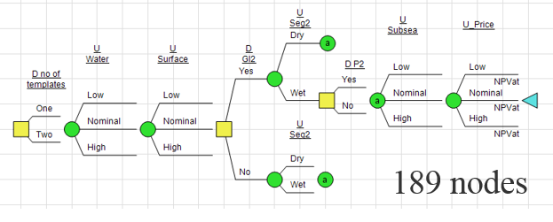
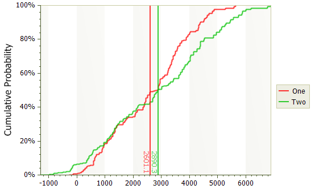
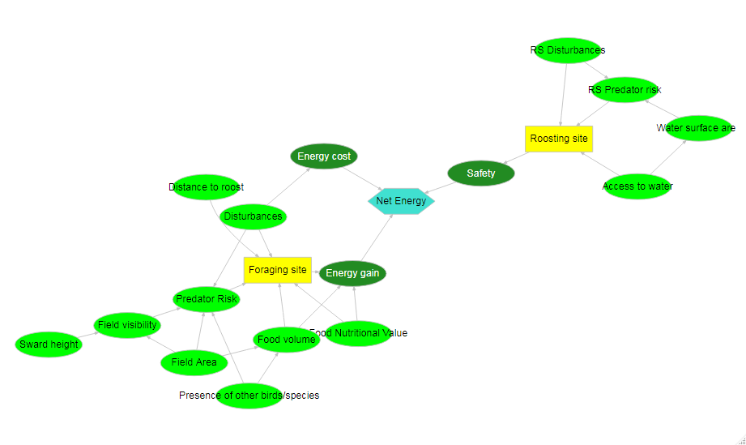

```{r setup, include=FALSE}
options(htmltools.dir.version = FALSE)
```

```{r xaringan-themer, include=FALSE}
library(xaringanthemer)
mono_light(base_color = "#472D0A") #56350B
```

# Why this PhD program?

Last 7 years I spent helping companies and individuals making **better decisions**. 
--

.pull-left[

In **Business**:

- Main challenges are around frame and alternatives

- Uncertainties are learned from data, simulated or elicited

- Most decisions are single-objective
]

.pull-right[

]

--

In **Environmental Science**:

- Multiple, conflicting objectives, complex dynamic systems

- Uncertainties are learned through evidence

--

### It is just the next step `r icon::fa("rocket")`

???
*Image credit: [SDG](www.sdg.com)*

---

class: inverse, middle, center

# How did I get here?

---
# From mining town to silicon valley

.pull-left[

BSc in *Econ Cybernetics* from [Kryvyi Rih Tech University](http://www.knu.edu.ua/en)

- Individual project on Queueing Theory: *"Vehicle service simulation for open-pit mine"*. Written in Pascal/Delphi. 

- Final project: *"Replenishment Planning for Inventory Systems"*. Real case from Iron Ore Processing factory.

*MBA, Finance* from  [Cal State, East Bay](https://www.csueastbay.edu/)

- Alumni of [Edmund Muskie Graduate Fellowship Program](https://en.wikipedia.org/wiki/Edmund_S._Muskie_Graduate_Fellowship_Program)

- Internship at [Safeway Inc](https://en.wikipedia.org/wiki/Safeway_Inc.): assortment optimization, forecasting, demographics, customer loyalty data.

]

.pull-right[

```{r out.width='100%', fig.height=5, eval=require('mapdeck'), echo=FALSE, error=FALSE, message=FALSE, warning=FALSE}
library(mapdeck)
library(tidyverse)

cities <- tribble(~city,  ~year, ~long, ~lat,
            "Kryvyi Rih, Ukraine", 1996, 33.401198, 47.904917,
            "Kyiv, Ukraine", 2001,30.520496, 50.441620,
            "Moscow, Russia", 2002, 37.616900, 55.752655,
            "Hayward, CA", 2003, -122.080795, 37.668819,
            "Tbilisi, Georgia", 2005, 44.801620, 41.693630,
            "Trondheim, Norway", 2011, 10.395053, 63.430515,
            "Oslo, Norway", 2014, 10.752245, 59.913868,
            "Lund, Sweden", 2018, 13.194710, 55.702888) %>% 
  mutate(long_from=lag(long), lat_from=lag(lat), city_from=lag(city)) %>% 
  mutate(move=glue::glue("{city_from} - {city} ({year})")) %>% 
  drop_na()

mapdeck(token=Sys.getenv("MAPBOX_TOKEN"), style = mapdeck_style('dark'), 
        zoom=4, pitch=60, location=c(30.5,50.4)) %>% 
  add_arc(
    data = cities
    , origin = c("long_from", "lat_from")
    , destination = c("long", "lat")
    , stroke_from = "city_from"
    , stroke_to = "city"
    , stroke_width = 5
    , tooltip = "move"
    , layer_id = 'arc_layer'
  ) 


```

]

---
# Decision Analysis journey

.pull-left[
Moved to Norway in 2011 to start as **decision support analyst** in Statoil. 

- Methodology shaped by Prof. Reidar Bratvold (University of Stavanger)

- Major capital investment projects: concept selection, appraisal strategy, environmental impact for new infrastructure

- Raised to **principal analyst**, developed and taught *"Introduction to Decision Quality"* course for upper-middle management 

- Modeling in [@Risk](www.palisade.com), Excel, [DPL](www.syncopation.com) and R. 
]

.pull-right[
<center>


</center>
]

---

class: inverse, middle, center

# The road ahead

---
# Geese management in agricultural landscapes

Spatial-temporal ecological economic system with different types of agents, including farmers and geese.

.pull-left[
+ Agent-based modelling to understand how agents make decisions under uncertainty

+ Quantifying uncertainty in models informed by data and/or expert judgement

+ Impact of uncertainty on model outputs

+ Uncertainty as relative frequency, subjective Bayesian probability or bounded probability

`r emo::ji("package")` `RNetLogo`, `SHELF` `r emo::ji("package")` 
]

.pull-right[

]

---
# Related projects

**University of Stirling**

Redpath, S. M., Keane, A., Andrén, H., Baynham-Herd, Z., Bunnefeld, N., Duthie, A. B., Frank, J., Garcia, C.A., Månsson, J., Nilsson, L. & Pollard, C. R. (2018). Games as Tools to Address Conservation Conflicts. *Trends in ecology & evolution*, 33(6), 415-426.

+ `GMSE` package
+ Genetic algorithm, game-theoretic decision approach
+ Geese management in Sweden [project](https://www.conservationconflicts.info/copy-of-geese-and-crop-farmers-1) in cooperation with Lund University (Maria Johansson, Dept of Architecture and Build Environment)

**Aarhus University**

Chudzińska, M., Ayllón, D., Madsen, J., & Nabe-Nielsen, J. (2016). Discriminating between possible foraging decisions using pattern-oriented modelling: The case of pink-footed geese in Mid-Norway during their spring migration. *Ecological modelling*, 320, 299-315.

+ Individual-based model
+ NetLogo implementation

---
# Related projects

**University of Amsterdam**

Dokter, A. M., Fokkema, W., Ebbinge, B. S., Olff, H., van der Jeugd, H. P., & Nolet, B. A. (2018). Agricultural pastures challenge the attractiveness of natural saltmarsh for a migratory goose. Journal of Applied Ecology.

+ GPS and accelerometer equipment
+ Open data

**Swedish University of Agricultural Sciences (SLU)**

Olsson, C. (2018). Foraging and movement patterns by geese in agricultural landscapes.

Montras Janer, T. (2016). Factors behind the risk of crop damage caused by wintering and migrating large grazing birds (geese and swans).

+ Literature review
+ Scandinavian data
+ Both attended Ecology of Animal Migration at Lund ([next session in November 2019](https://www.canmove.lu.se/courses-workshops/courses/ecology-of-animal-migration-2019))

---
class: center, middle

# Thanks!

Slides created via the R package [**xaringan**](https://github.com/yihui/xaringan).

The chakra comes from [remark.js](https://remarkjs.com), [**knitr**](http://yihui.name/knitr), and [R Markdown](https://rmarkdown.rstudio.com).
